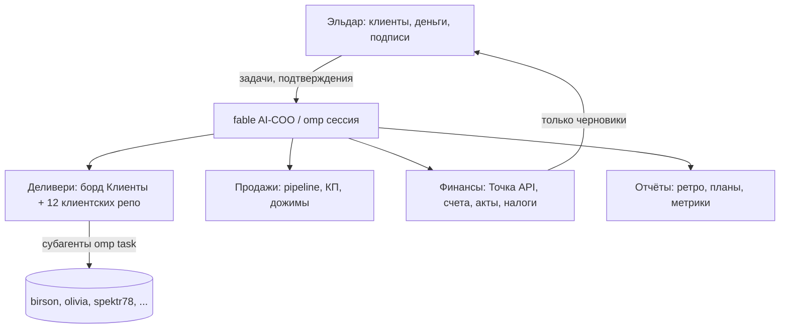

# AI-COO: стратегия внедрения операционного директора для Eldar Marketing

Дата: 2026-07-22. Основано на ресёрче: `research-ai-coo.md` (кейсы и паттерны), `research-rf-accounting.md` (бухгалтерия РФ 2026).

## 1. Цель

Владелец общается с клиентами и принимает деньги. AI-COO (модель fable в omp) в каждой сессии проекта eldar.marketing принимает задачи как операционный директор: деливери, продажи, финансы, аналитика, отчёты.

## 2. Что уже реализовано (фаза 0 — готово)

| Компонент | Файл | Эффект |
|---|---|---|
| fable закреплён per-project | `.omp/config.yml` | roles default/plan/slow/designer = `anthropic/claude-fable-5`; проектный слой переживает смену глобального конфига |
| COO-роль в каждой сессии | `.omp/APPEND_SYSTEM.md` | добавляется к системному промпту, скиллы и дефолтные правила сохраняются; зоны ответственности + approval-тиры + команда «брифинг» |
| Ресёрч-база | `docs/ai-coo/research-*.md` | нормы РФ 2026, API банков, паттерны AI-ops |

**Важно**: omp подхватывает `.omp/` только при старте из корня репо (`~/eldar-marketing-hugo`), без walk-up по родительским директориям.

Существующая база, на которую опираемся: скиллы `go` (роутер задач), `github-tasks` (борд «Клиенты» = kanban-интерфейс агента), `weekly-planning`/`weekly-retro`, `post-content`, `decompose`, `project-init`; MCP: telegram-reader, email, github, firecrawl, memory; Точка API JWT в `~/.config/tochka/.env`.

## 3. Архитектура: четыре контура

1. **Деливери.** Борд GitHub Project «Клиенты» — единственный источник правды (паттерн «kanban as agent interface»). COO читает Inbox, декомпозирует (`decompose`), исполняет через субагентов в клиентских репо, двигает карточки, эскалирует зависшее.
2. **Продажи.** Pipeline на том же борде (department: Лиды). Черновики КП/смет по шаблонам `reports/`, follow-up-черновики. Отправка — только после «ок» владельца.
3. **Финансы (РФ 2026).** Автоматически: выписка Точка → сверка поступлений с договорами → книга доходов → напоминания (УСН: взносы 57 390 ₽ + 1% свыше 300 тыс., срок 28.12; НДС-порог УСН **20 млн ₽** с 2026, далее 15/10 млн) → черновики счетов и актов. Никогда сам: платежи, подписи ЭЦП, декларации (см. таблицу операций в `research-rf-accounting.md` §5).
4. **Отчёты.** Пн — `weekly-planning`, Пт — `weekly-retro`, ежемесячно — сводка выручки по выписке + загрузка по клиентам.

## 4. Режимы работы

- **Интерактив** (основной): `omp` из корня репо → fable-COO с чартером. Команда «брифинг» — утренняя сводка.
- **По расписанию** (фаза 2): headless-запуски `omp -p "<задача>" --max-time 15m` через launchd/cron: утренний брифинг в Telegram-«Saved», дневной heartbeat по борду (молчать, если всё ок), пятничное ретро. Паттерн: heartbeat для внутреннего контроля, cron для публичного/срочного, watchdog-скрипты без LLM для алертов.
- **Advisor/WATCHDOG.md** (опционально): второй взгляд sonnet на каждый ход COO при финансовых операциях.

## 5. Уровни автономии (уроки Project Vend и TheAgentCompany)

Ресёрч однозначен: лучшие модели решают <35% сложных long-horizon задач автономно; финансовые галлюцинации — структурное свойство LLM. Поэтому:

| Тир | Действия | Режим |
|---|---|---|
| T0 авто | чтение, анализ, код, черновики, борд, расчёты | без вопросов |
| T1 подтверждение | исходящие клиентам, публикации, деплой, выставление счетов | «ок» на каждое действие |
| T2 только человек | платежи, ЭЦП, декларации, договорные обязательства, удаление данных | COO готовит, Эльдар исполняет |

Правила против «тихих провалов»: каждая цифра — из документа/API; противоречие в данных — стоп и доклад; итог сессии — резюме «сделано / ждёт владельца / заблокировано».

## 6. Дорожная карта

**Фаза 1 — Операционка (1–2 недели).** Обкатать чартер: брифинги, ведение борда, декомпозиция входящих задач клиентов, недельные ритуалы. Критерий: неделя, где все клиентские задачи прошли через борд без ручного ведения.

**Фаза 2 — Финансовый контур. ✅ Реализовано 2026-07-22.** CLI `scripts/tochka/tochka.py` (Точка Open API, оба ИП: Малышев — агентство, Абилвапов — второй профиль): `balance`, `statement`, `yesterday`, `income` — база УСН 6% с исключением своих переводов и бакетом «⚠️ классифицировать» для наличных; счета/акты — существующий `~/eldar_progress/scripts/tochka/bill.py`; реестр договоров `docs/ai-coo/contracts.yml`; скилл `tochka` (`~/.claude/skills/tochka/`). Налоговый календарь — `tax-profile.md`: авансы 28.04/28.07/28.10, взносы 57 390 ₽ до 28.12, 1% до 01.07, декларация до 25.04, НДС-порог 20 млн ₽. Осталось из фазы: вебхуки о поступлениях (пока polling через `yesterday`).

**Фаза 3 — Автономные циклы. ✅ Реализовано 2026-07-22.** `scripts/coo/run.sh` + launchd (`~/Library/LaunchAgents/com.eldarmarketing.coo.*`): утренний брифинг 09:00 ежедневно, heartbeat 13:00/18:00 (молчит, если всё ок — «default to silence»), черновик ретро пт 17:00. Логи в `.briefings/` (gitignored), уведомления через macOS notifications. Модели по квотам: heartbeat — sonnet, briefing/retro — GPT Sol (Codex-квота), интерактив остаётся на fable. Проверено вживую через `launchctl kickstart`. Известное ограничение: `telegram-reader` однопользовательский — при параллельной интерактивной сессии джоб честно сообщает «Telegram не проверен» (database is locked). Осталось из фазы: дожимы лидов по расписанию — после обкатки продажного контура.

**Фаза 4 — Масштабирование (по мере роста).** ЭДО Диадок API (черновики УПД/актов для юрлиц), МЧД; долговременная память (memory backend omp / knowledge graph по клиентам); метрики COO: время реакции на входящую задачу, доля задач без возврата, дебиторка.

## 7. Риски

| Риск | Митигация |
|---|---|
| Галлюцинации в финансах | T2-тир, цифры только из API/документов, advisor на финансовых сессиях |
| Тихие провалы (silently wrong) | обязательное резюме сессии, watchdog-скрипты без LLM для сверки сумм |
| Изменения законов РФ | веб-проверка норм перед каждым расчётом; чартер это требует |
| Юридическая сила документов | агент выпускает только черновики; подпись всегда за ИП |
| Зависимость от одной модели | fallbackChains в глобальном конфиге; борд как внешнее состояние переживает любую сессию |
